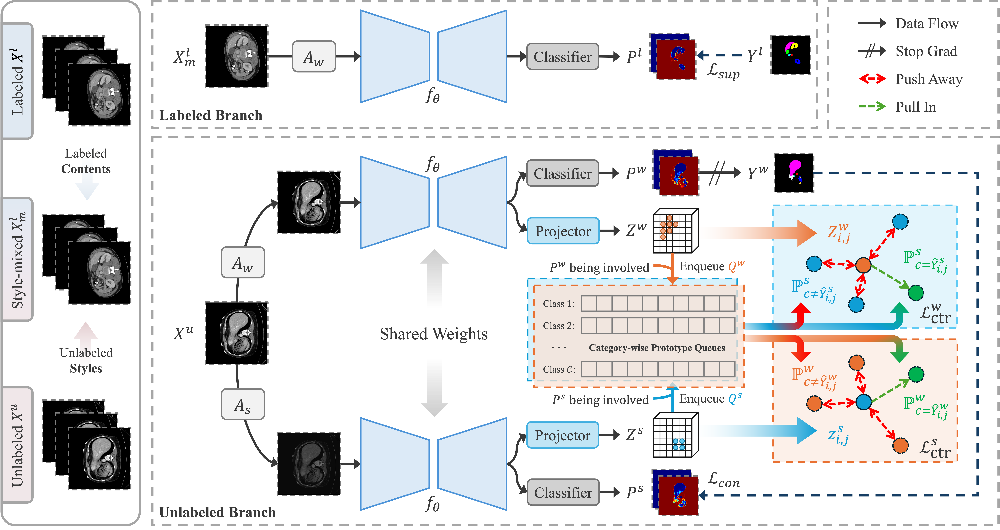

<div align="center">
<h1>Style-Aware Blending and Prototype-Based Cross-Contrast Consistency for Semi-Supervised Medical Image Segmentation</h1>

[Chaowei Chen](mailto:chishengchen@stu.ynu.edu.cn)<sup>1</sup>,[Xiang Zhang](mailto:#)<sup>1</sup>,[Honglie Guo](mailto:#)<sup>1</sup>, [Shunfang Wang](mailto:sfwang_66@ynu.edu.cn)<sup>1,2,*</sup>

<div><sup>1</sup>School of Information Science and Engineering, Yunnan University, Kunming, 650504, Yunnan, China</div>
<div><sup>2</sup>Yunnan Key Laboratory of Intelligent Systems and Computing, Yunnan University, Kunming, 650504, Yunnan, China</div>

Paper: ([arXiv 2507.20729](https://arxiv.org/pdf/2507.20729))

</div>

## Abstract
Weak-strong consistency learning strategies are widely employed in semi-supervised medical image segmentation to train models by leveraging limited labeled data and enforcing weak-to-strong consistency. However, existing methods primarily focus on designing and combining various perturbation schemes, overlooking the inherent potential and limitations within the framework itself. In this paper, we first identify two critical deficiencies: (1) separated training data streams, which lead to confirmation bias dominated by the labeled stream; and (2) incomplete utilization of supervisory information, which limits exploration of strong-to-weak consistency. To tackle these challenges, we propose a style-aware blending and prototype-based cross-contrast consistency learning framework. Specifically, inspired by the empirical observation that the distribution mismatch between labeled and unlabeled data can be characterized by statistical moments, we design a style-guided distribution blending module to break the independent training data streams. Meanwhile, considering the potential noise in strong pseudo-labels, we introduce a prototype-based cross-contrast strategy to encourage the model to learn informative supervisory signals from both weak-to-strong and strong-to-weak predictions, while mitigating the adverse effects of noise. Experimental results demonstrate the effectiveness and superiority of our framework across multiple medical segmentation benchmarks under various semi-supervised settings.

## Overview
We propose a style-aware blending and prototype-based cross-contrast consistency framework for semi-supervised medical image segmentation. The method addresses distribution mismatch between labeled and unlabeled data while enabling bidirectional consistency learning.



## Main Results

### Synapse Multi-Organ Dataset
| Method | Labeled | DSC | ASD | Aorta | GB | KL | KR | Liver | PC | SP | SM |
|--------|---------|-------|-------|-------|----|----|----|----|----|----|-----|
| Ours (MT) | 1 (5%) | 60.00 | 19.73 | 79.53 | 40.52 | 68.59 | 63.05 | 89.80 | 20.70 | 78.38 | 39.00 |
| Ours (BCP) | 1 (5%) | 61.87 | 18.81 | 80.07 | 38.78 | 68.30 | 63.12 | 91.60 | 24.54 | 80.65 | 47.93 |
| Ours (MT) | 4 (10%) | 65.81 | 15.88 | 80.77 | 45.42 | 76.39 | 76.45 | 90.10 | 30.14 | 75.84 | 51.36 |
| Ours (BCP) | 4 (10%) | 66.59 | 23.52 | 81.79 | 40.09 | 76.80 | 68.64 | 90.43 | 38.80 | 75.79 | 60.39 |

### ACDC Cardiac Dataset
| Method | Labeled | DSC | ASD | Myo | LV | RV |
|--------|---------|-------|-------|-----|----|----|
| Ours (MT) | 3 (5%) | 87.31 | 1.10 | 85.60 | 84.90 | 91.42 |
| Ours (BCP) | 3 (5%) | 88.60 | 0.61 | 87.36 | 85.51 | 92.93 |
| Ours (MT) | 7 (10%) | 89.27 | 0.63 | 88.35 | 86.63 | 92.82 |
| Ours (BCP) | 7 (10%) | 89.80 | 0.95 | 90.36 | 86.10 | 92.94 |

## Installation

We recommend the following platforms:
```bash
Python 3.8+ / PyTorch 2.0.0+ / CUDA 11.8+
```

Install the necessary packages:
```bash
pip install -r requirements.txt
```

Set the dataset path environment variable:
```bash
export DATASET_HOME=/path/to/your/datasets
```

## Dataset Preparation

### ACDC Cardiac Dataset
Download the preprocessed ACDC dataset from [SSL4MIS](https://github.com/HiLab-git/SSL4MIS/tree/master/data/ACDC) and extract and organize the data:
```
$DATASET_HOME/
└── ACDC/
    ├── data/
    │   ├── slices/*.h5
    │   └── *.h5
    └── train_slices.list
    └── val.list
    └── test.list
```

### Synapse Multi-Organ Dataset
Sign up at the [official Synapse website](https://www.synapse.org/#!Synapse:syn3193805/wiki/89480) or download the dataset using the [preprocessed data](https://drive.google.com/file/d/1tGqMx-E4QZpSg2HQbVq5W3KSTHSG0hjK/view?usp=share_link). Split the dataset according to the 5% and 10% protocols and organize it in a structure similar to the ACDC dataset.

## Training

### Mean Teacher Framework
```bash
# Synapse dataset
python train_Ours_MT.py --name Synapse --labelnum 5   # 5% labeled
python train_Ours_MT.py --name Synapse --labelnum 10  # 10% labeled

# ACDC dataset
python train_Ours_MT.py --name ACDC --labelnum 5      # 5% labeled
python train_Ours_MT.py --name ACDC --labelnum 10     # 10% labeled
```

### BCP Framework
```bash
# Synapse dataset
python train_Ours_BCP.py --name Synapse --labelnum 5   # 5% labeled
python train_Ours_BCP.py --name Synapse --labelnum 10  # 10% labeled

# ACDC dataset
python train_Ours_BCP.py --name ACDC --labelnum 5      # 5% labeled
python train_Ours_BCP.py --name ACDC --labelnum 10     # 10% labeled
```

## Testing

```bash
# Testing on Synapse dataset
bash test_Synapse.sh

# Testing on ACDC dataset
bash test_ACDC.sh
```

## Acknowledgments

We thank the authors of [SSL4MIS](https://github.com/HiLab-git/SSL4MIS), [TransUNet](https://github.com/Beckschen/TransUNet), and [BCP](https://github.com/DeepMed-Lab-ECNU/BCP) for making their valuable code & data publicly available.